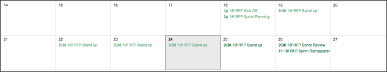

<a href="https://openfda.ctacdev.com" target="_blank">Working prototype</a>

CTAC has supported the GSA (OCIO and OCSIT) for the past 3+ years and is currently developing GSA’s Open Source Drupal/WordPress Platform-as-a-Service (PaaS) FedRAMP Content Management Platform (CMP), with on-board staff certified in agile methodologies. Additionally, we have supported the Department of Health and Human Services’ (HHS’) mission for the past 16+ years by applying new open source technologies as innovative solutions in the HHS marketplace. Our “user-centric” approach to designing and developing systems and applications allows us to deliver products and services on time and in budget.  Our project management approach coupled with our agile methodology allows us manage risk appropriately, especially in a firm-fixed price environment. We understand the nature of 18F’s business model, i.e., fee for services and believe that we are uniquely positioned to deliver quality products and services in the competitive marketplace.
Our first step to build this prototype was to identify the proper User-Centered Design (UCD) approaches.  We involved potential users in as many steps as possible from the brainstorming phase to the prototype. Our Product Owner (PO), the lean agile leader of the multidisciplinary team that produced this prototype, represents our customer/ industry surrogate, and is the accountable team leader with the vision of the solution and ability to ensure a timely release of a quality deliverable**(a)****(b)**. The PO led a self-organizing agile team empowered to define the product’s requirements, create and test the usability of the proposed design, develop and test the application, and create and run test cases to validate the solution against the requirements.  The team, worked in a time boxed and iterative cycle****(g)****, sought input from all stakeholders and built the application using TDD techniques to produce a high quality, working slice of the application subjected to usability testing and feedback. The results were fed back into the iterative process for further refinement.

Our UCD process focused on the end users’ perceptions and habits to map the web application experience, rather than rely on the vision of a single creative source. This allowed the end user to steer all aspects of the process – not just the interface or technologies. Our process was coupled with six specific types of UCD techniques (Personas, User Interviews, Workflow Determination, User Testing, Prototyping, and Accessibility Testing)**(c)**.  

User profiles were created by researching demographics, posed a character based on those findings, and gave them relatable biographies and a humanized situation to comprehend their potential interaction with the app. Personas determined our interviewees, and we started with broad questions like “What do you expect from this application [that can query a drug database]?” Answers helped us understand the motives of potential users**(c)**, and interviews gave specific insight of user requirements.

We mapped our findings with flowcharts that demonstrated how to achieve the users end-goal.  Testing was done with simple wireframe drawings to confirm that the workflows were correct. With the testing, we quickly determined that our users primary interest in the FDA API was the potential ingredient overlaps between commonly prescribed drugs that could create a toxic combination**(c)**. Tangential ideas were then relegated to a prioritized backlog.  We tested usability, and refined the functionality through interactive wireframes that allowed users to provide instant feedback on potential workflow inefficiencies.

While the comp was based on the final wireframe, the aesthetic details of the application in UCD were not allowed to detract from the product’s mission which should be instantly recognizable.  Subsequently, developers received a style guide for the initial development**(e)**.  We tested to ensure that color contrasts, text size, and tabbing orders allowed access to users with color, visual or other impairments, and included a tailored checklist for use during development, and relied on standard design patterns that users are familiar with and responsive web design to improve accessibility across a variety of common mobile Internet devices**(h)**.

We relied exclusively on open source and free technologies: the front end framework was built with Bootstrap, the SASS preprocessor ensured streamlined styling, the Rails application framework built on Ruby provided the architecture, and this front-end code was developed using the Brackets editor**(f)** to reduce development costs while improving the quality and security posture of the prototype. We did an iteration of user testing with the application on multiple devices. After presenting the prototype in a casual user feedback session involving users, we found that the “Interaction Widget’ application workflow needed rethinking, and we were able to resolve the issue to the satisfaction of our stakeholders. The final portion of our quality check process tested the integrity of the customer-supplied documentation by installing and running the application using the installation documentation and instructions**(p)** to ensure the deployment of a dependency free deliverable.

After the design was completed, our Agile/Scrum certified development team followed an agile methodology to iteratively design, develop, implement, test, and improve requirements in short iterations.  Our development process allowed stakeholders to provide constructive feedback and ensure transparency throughout the process. CTAC’s agile/scrum coach identified resources and held an internal kickoff with team members to decide on a team lead with the responsibilities and accountability for monitoring timely completion of tasks, assessing the quality of work utilizing the Gitflow process of code commits and reviews, and ensuring adequate documentation**(a)****(b)**.

We established the technical vision for this project, and made decisions based on what data the OpenFDA API made available, how the data could be visually interesting, and what could be useful to audiences that would likely be consuming the data. Using this information as a foundation for the technical frameworks, we decided to use Ruby on Rails for its strong API-friendly framework, flexibility for reuse and sustainability**(i)**.  For the front-end we used technologies such as Handlebars.JS**(i)**. Insight gathered from potential users illustrated a need to provide health related information in a meaningful way to reflect the change in social habits where users want technology to help them become more knowledgeable about health conditions and to make informed decisions in a simple and intuitive way. To meet these needs and our own goals of interactivity and meaningful data display, we decided to use visualization tool D3 because it interactively displays information, is flexible and reliable, and allowed us to create custom code to make the app responsive which is a main focus in any of our builds.

Each sprint cycle included sprint planning (meaningful user stories, backlog prioritizations, release planning), daily 15 minute “standups” (quick reviews of tasks, flagging of impediments), and sprint reviews (demos/review of accomplishments, retrospectives/suggestions for continuous improvement). The calendar below represents a sample schedule of our daily tasks, sprint planning, and retrospectives.

Utilizing TDD practices is standard at CTAC as defined in our Playbook. As part of this project, each developer began by writing a unit test, using RSpec for Ruby/Rails or QUnitJs for Javascript, for the task they picked up to ensure the goals of the task were fulfilled**(i)****(k)**. Once the unit test was written, the coding effort began with the focus of passing the test. The code was adjusted until the test had been passed and the developer then moved to the next task.

As developers completed tasks and passed their automated tests, our GitFlow process and Code Review standards were monitored by the project lead. Commit messages were created by team members for their code as it was checked into their feature branch and a pull request within the GitHub repository was created. Automated code tools were deployed that were integrated with our Slack channel.  All team members were kept up to date and collaborated via slack and google hangouts. The app was “containerized” using Docker, enabling members of the team to easily check out the project and fire up a complete working instance with a simple command**(o)**. Once a release was cut (tests pass, code pushed, a version number chosen, tagged, and merged into the master repository), the Jenkins Continuous Integration server automatically deployed the container to Amazon Elastic Beanstalk**(j)****(l)**. Amazon Services used the Dockerfile included in the project to build and deploy a new production version of the application automatically in just minutes**(m)**, an approach known as continuous delivery platform (extremely short intervals between feature request and production release)**(l)**.  

At the end of the sprint, the team prepared a demo of the tasks accomplished to the Product Owner and Stakeholders to gain feedback (requirement sign-off, updated requirements, new features). Tasks were entered into the backlog to groom and prioritize with Stakeholders that became the basis of the next sprint.  After completing the sprint, a retrospective, facilitated by our Agile Coach, was held with the team to review the process and gain feedback from the team to continually look for process improvements.

We tested the integrity of the application by installing and running it using the installation documentation and instructions provided**(p)**, and our prototype consists only of open source or public domain licensed technologies**(q)**.
